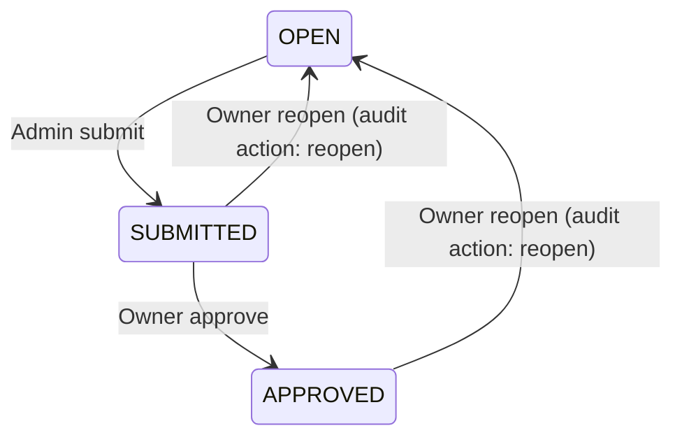

# Employee Time & Activity Tracking — Spec v1 (MVP)

**Company:** 20–30 employees · Long Island City, NY
**Stack:** Node.js + Express + TypeScript + MySQL 8 + React (Vite)
**Goal:** Replace paper timecards with a simple web app that records time-in/time-out and shows the owner a weekly summary.

**Success test:** Admin enters a full week in under 15 minutes. Owner reviews and approves in under 5.

---

## 1. Scope

### In scope (v1)
- Login / logout / current user
- Employee roster (add, list)
- Pay periods (create weekly, list)
- Timecard entry: daily time-in / time-out per employee
- Weekly totals: regular, OT, holiday, sick hours + bonus, reimbursement
- Owner approval of a period
- Owner weekly report (on screen)

### Out of scope (v1 → deferred to v2)
- Leave ledger UI, holiday credits, substitutions
- Cash payment tracking UI
- Excel / PDF exports
- Wage-rule enforcement beyond minimum-wage check
- Alerts beyond the six listed in §6
- Trend charts, audit UI, per-employee history pages
- 2FA (design-ready, not implemented)

---

## 2. Roles

| Action | Admin | Owner |
|--------|-------|-------|
| Add / edit employees | Yes | View |
| Create pay periods | Yes | No |
| Enter / edit timecards (period OPEN) | Yes | No |
| Submit a period | Yes | No |
| Approve a period | No | Yes |
| Reopen a submitted or approved period | No | Yes |
| View weekly report | Yes | Yes |

Two roles only: `ADMIN`, `OWNER`. Role checks enforced server-side.

---

## 3. Pay period workflow

| Transition | Role | Result |
|------------|------|--------|
| OPEN → SUBMITTED | Admin | Locks timecard editing; audit action `status` |
| SUBMITTED → APPROVED | Owner | Approves and locks the period; audit action `status` |
| SUBMITTED → OPEN | Owner | Reopens for editing; reason required; audit action `reopen` |
| APPROVED → OPEN | Owner | Reopens for editing; reason required; audit action `reopen` |

All transitions write to `audit_log`. Reopen clears the submission and approval metadata; the required reason is recorded with the `reopen` audit event.

---

## 4. Timecard entry

Each employee-day row has:
- `work_date` (DATE)
- `day_type`: `WORK` | `HOLIDAY` | `SICK` | `VACATION`
- `time_in` (TIME, nullable)
- `time_out` (TIME, nullable)
- `hours` (DECIMAL, computed from in/out if both present, else typed)

**Daily rows are the source of truth.** Weekly totals are always derived, never typed.

---

## 5. Weekly calculation

Weekly extras (typed on the weekly header row):
- `bonus_amount` DECIMAL
- `reimbursement_amount` DECIMAL
- `notes` TEXT

All totals computed in the `timecard_weekly` view. Nothing stored.

---

## 6. Alerts (v1 — six only)

| Alert | Trigger |
|-------|---------|
| Missing entry | Active employee with no timecard in an OPEN or SUBMITTED period |
| Overtime detected | Hourly employee with `ot_hours > 0` |
| Leave overdraw | Leave usage exceeds available balance |
| Post-submit edit | Any change after a period was SUBMITTED |
| Awaiting approval | Period in SUBMITTED state |
| Below minimum wage | Hourly rate below current NYC minimum |

All other alerts are deferred to v2.

---

## 7. Screens (three only)

### 1. Login
Email + password. Session cookie. Redirect to role-appropriate home.

### 2. Timecard Entry (Admin)
Grid: one row per employee, Mon–Sun columns. Type `8` for regular, or `H8` / `S8` / `V8` for holiday / sick / vacation. Optional expand to enter time-in/time-out per day. Weekly columns show Reg, OT, Hol, Sick, Vacation (read-only, computed). Bonus and Reimbursement are typed columns. Save button. Submit button (locks for admin).

### 3. Owner Report (Owner)
One table: employee name + regular, OT, holiday, sick, vacation hours + bonus + reimbursement. Period picker. Approve button at top. Read-only.

---

## 8. API routes (v1)

| Method | Route | Role | Purpose |
|--------|-------|------|---------|
| POST | `/api/auth/login` | any | Login |
| POST | `/api/auth/logout` | any | Logout |
| GET | `/api/auth/me` | auth | Current user |
| GET | `/api/employees` | auth | List employees |
| POST | `/api/employees` | admin | Add employee |
| GET | `/api/pay-periods` | auth | List periods |
| POST | `/api/pay-periods` | admin | Create period |
| GET | `/api/timecards/:periodId` | auth | Load timecard data |
| PUT | `/api/timecards/:periodId` | admin | Save daily entries + extras |
| POST | `/api/pay-periods/:id/submit` | admin | OPEN → SUBMITTED |
| POST | `/api/pay-periods/:id/approve` | owner | SUBMITTED → APPROVED |
| POST | `/api/pay-periods/:id/reopen` | owner | SUBMITTED or APPROVED → OPEN (reason required) |

---

## 9. Hard rules (must be respected even in v1)

These are cheap now, expensive later. Do not skip them.

1. **Every mutation writes to `audit_log`.** Actor, action, entity, timestamp, before/after values. Even simple inserts.

2. **Every write to `timecard_entries`, `timecard_days`, or `pay_periods` uses the `withOpenPeriod` wrapper** — a transaction that locks the period row FOR UPDATE and re-checks status.

3. **Compensation lives in `employee_compensation`, not on `employees`.** Adding an employee = two inserts in one transaction (employee + comp row).

4. **Leave usage goes into `leave_ledger`, never as a stored balance.** Balance = `SUM(hours)`.

<!-- 5. **No hard deletes.** Use `termination_date` for employees, status for periods. Payroll records are retained (NY baseline: 6 years). -->

---

## 10. Database

The schema in `server/src/db/migrations/001_init.sql` is **unchanged**. All 16 tables exist. v1 uses a subset of them:

**Actively used in v1:**
- `users`, `sessions`
- `employees`, `employee_compensation`
- `pay_periods`
- `timecard_entries`, `timecard_days`
- `timecard_weekly` (view)
- `leave_ledger`, `leave_balances` (view) — written when sick/vacation is entered
- `audit_log`
- `wage_rules` — read for minimum-wage check

**Present but unused in v1 (do not drop):**
- `holidays`, `holiday_substitutions`, `holiday_credits`
- `leave_types`, `leave_policies`
- `cash_payments`, `export_log`, `attachments`, `settings`

Unused tables cost nothing. They become active in v2.

---

## 11. Deferred to v2

- Leave policies UI + accrual configuration
- Holiday credits and substitutions
- Cash payment tracking + receipts
- Excel and PDF exports (waiting on CPA sample)
- Audit log UI
- Trend charts, per-employee history pages
- 2FA implementation
- Automated backups

See `docs/spec-v2-target.md` for the full target.

---

## 12. Open questions (still need answers)

- Do vacation and holiday hours count toward the 40-hour OT threshold? (Assumed no in v1.)
- Exact sick-day code mapping: is `S8` always `SICK_SAFE_PAID`?
- CPA sample file for export column layout (v2 blocker).
- Is a signed cash receipt legally required? (v2 blocker.)

None of these block v1.

---

## 13. Definition of done (v1)

- All ten routes working, tested
- Three screens rendering correctly
- Timecard entry → weekly view → report shows correct numbers
- Submit → approve workflow locks the period
- Audit log records every mutation
- Tests: type-check clean, all existing tests pass, new route tests added
- Deployed to a dev environment (localhost is acceptable for v1)

---

*Spec v1 authored 2026-09-28. Target architecture: docs/spec-v2-target.md.*
